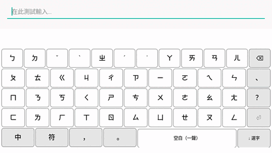

# sloth-zhuyin-linux · 懶 Slothing

**A libchewing-free, LLM-powered Zhuyin (Bopomofo) input method** — for Linux
(**fcitx5** and **IBus**), **Android** (a native IME with on-device decoding),
plus a fully in-browser web demo. Type bopomofo; a tiny from-scratch model
decodes it to Traditional Chinese under a phonetic-legality constraint, so every
character is a real reading of what you typed — never a hallucination.

**中文說明（預設）: [README.md](README.md)**

> **Live demo (free, runs entirely in your browser):**
> **https://huggingface.co/spaces/Luigi/slothing-web**
> Type on the on-screen Dàqiān keyboard or your physical keyboard — Chinese,
> English, and mixed input auto-detected with no mode key.

<p align="center"></p>

## Four frontends, one core

All four are built on the **frontend-free core** in `engine/common` (one state
machine, one zh/en DP segmenter, one decode implementation), so the interaction
is identical — the GIF above is the web demo, but fcitx5 / IBus behave exactly
the same.

| Frontend | Platform | Notes |
|---|---|---|
| **fcitx5** | Linux (KDE/general) | Native addon, libchewing-free. `engine/fcitx5-chewing/` |
| **IBus** | Linux (GNOME, …) | Same core; ships a headless end-to-end test (private ibus-daemon, key-by-key). `engine/ibus-slothing/` |
| **Android** | phone/tablet (incl. e-ink) | Native Kotlin IME; ports slothingd's decode to on-device C++ (ONNX Runtime, offline). `android/` |
| **Web demo** | browser | onnxruntime-web; no install, free, never sleeps. `space-static/` |

**Android** (tested on an ONYX BOOX Tab Mini C e-ink tablet) — native Dàqiān
bopomofo keyboard, whole-sentence 免選字 conversion, fully offline. On-device
decode is the same model as the desktop: **172/230 = 74%** on the 230-case
免選字 benchmark, identical to the desktop model (99% per-sentence agreement).

Honest, sourced comparison vs Gboard 注音 and the Boox built-in IME: **[docs/COMPARISON.md](docs/COMPARISON.md)** (zh-TW)

<p align="center"></p>

## What it is

Slothing replaces the statistical decoder of a traditional zhuyin IME (like
chewing) with a small language model, while keeping the guarantee that output
is always phonetically legal. Two things make it different from every other
open-source zhuyin IME (McBopomofo, vChewing, libchewing are all purely
statistical):

- **The model decodes, not just reranks.** A bopomofo→Chinese model resolves
  the homophones a dictionary IME gets wrong (它→他, 在/再, 覺/決) using
  sentence context.
- **No libchewing.** A dependency-free keyboard FSM parses keystrokes; the
  model decodes; a per-position legal-character grammar guarantees valid
  readings. Local, private, no cloud.

## The models

| | SlothLM (v1) | **SlothLM-E** (v2) |
|---|---|---|
| type | causal decoder-LM (Llama) | **bidirectional encoder** |
| params | ~34M | **3.8M (NAS + weight tying)** |
| decode | autoregressive | **non-autoregressive, 1 pass** |
| tonal accuracy | ~beats chewing | **83% (chewing 71%)** |
| tone-free accuracy | weak | **70%** — usable tone-free typing |
| on HF | (removed) | [Luigi/slothlm-e-4m-zhuyin](https://huggingface.co/Luigi/slothlm-e-4m-zhuyin) |

Zhuyin decode is *aligned sequence labeling* (N syllables → N characters, 1:1,
each constrained), so a **bidirectional encoder** fits the task far better than
a causal decoder: it sees the whole sentence (right-context disambiguation:
行走/銀行) and decodes in one pass. The current model is **3.8M parameters**,
found by an 18-config Hyperband **neural architecture search** over the sub-5M
space and trained on **g2pW context-aware readings** (neural Taiwan polyphone
disambiguation). It carries a **char-hint channel** (weight-tied to the output
head, ~0 params): user picks feed back as hints and the whole sentence
**re-scores** around them, 新注音-style; the same channel carries **document
context** (committed text before the cursor — after 我妹妹說, 他很漂亮 flips
to **她**很漂亮) and is trained with **typo noise** so the model repairs
mistyped syllables from context. Full reproduction pipeline (dataset → labels
→ NAS → training → ONNX) ships with the model on HF. See `model/DESIGN.md` and `model/DESIGN-E.md`.

## Features

- **Grammar-constrained decode** — output is masked to each syllable's
  phonetically-legal characters, so it can never hallucinate an invalid reading.
- **Tone-free typing** — drop the tone keys (~35% fewer keystrokes); the model
  disambiguates from context.
- **Auto Chinese/English** — no mode toggle: valid zhuyin adds one bopomofo
  symbol per keystroke, so an impossible-zhuyin keystroke run is detected as
  English (ASUS-IME style). English passes through verbatim; code-switch
  (`我用 Python 寫 code`) just works.
- **Chewing-shaped editing** — inline conversion, one-Enter commit, preedit
  cursor + mid-sentence editing, **model-score-ranked** paged candidates
  (↓ opens, word/char span views, number-key selection), punctuation + \`
  symbol menu, Shift 中/英 toggle, Shift+Space fullwidth.
- **Picks re-score the sentence** — correct one character and the rest
  re-decodes around your choice (the hint channel); picks are also
  **persistently learned** (calibrated logit bonuses that flip near-ties
  without polluting strong-context words).
- **Typo tolerant** — impossible syllables are repaired by the model from
  context (edit distance 1).
- **UI behavior verified against real libchewing** — the `eval/ui-parity/`
  differential suite compares per-keystroke UI state (12/12 interaction
  contracts pass); model quality is gated by `eval/chewing_parity.py` and a
  230-sentence 免選字 set.

## Repository layout

- `engine/common/` — the **frontend-free shared core** (single implementation,
  offline unit tests): the zh/en DP segmenter `segment.h` (lock-step with the
  web demo), the zhuyin keyboard FSM, the slothingd protocol client, and the
  whole interaction state machine `core.h` (candidate window, highlight loop,
  pick-triggered re-scoring, learn diff). Both engines are built on it.
- `engine/fcitx5-chewing/` — **Slothing**, the fcitx5 addon (the fcitx5
  adapter over the shared core). libchewing-free.
- `android/` — **Slothing for Android**: a native Kotlin `InputMethodService` +
  Dàqiān bopomofo keyboard on the same `engine/common` core, with slothingd's
  decode ported to on-device C++ (ONNX Runtime, over JNI) — fully offline on the
  phone, no daemon.
- `engine/ibus-slothing/` — **Slothing**, the IBus engine (for GNOME users):
  same core, same behavior; ships a headless end-to-end test (private
  ibus-daemon, key-by-key assertions).
- `engine/slothingd/` — the decode daemons: **`slothingd_e.py`** (current; a
  Unix-socket onnxruntime daemon serving SlothLM-E at ~1 ms/decode, tonal or
  toneless, English passthrough) and the legacy llama.cpp/GBNF `slothingd.cpp`
  for GGUF decoder models.
- `model/` — the models: tokenizer, data prep, training + eval for SlothLM
  (decoder) and **SlothLM-E** (encoder), `phonetic_table.tsv` (syllable → legal
  chars), and `chewing_parity.py` (the validation gate).
- `space-static/` — the web demo (`sdk: static`): the full IME UI running the
  model in-browser via onnxruntime-web (~5 MB int8 ONNX, works on iOS Safari)
  — free, never sleeps, no server.
- `eval/` — scored zhuyin→sentence test set and harnesses (rerank, decode,
  chewing-parity).
- `ARCHITECTURE.md`, `RESEARCH-LLM-IME.md`, `MODEL_BENCHMARKS.md`, `MIGRATION.md`.

IBus users (GNOME): see `engine/ibus-slothing/README.md` (same core, same
key behavior). Android: see below and `android/`.

## Build & install the fcitx5 addon

```sh
cmake -B engine/fcitx5-chewing/build -S engine/fcitx5-chewing \
    -DCMAKE_BUILD_TYPE=Release -DCMAKE_INSTALL_PREFIX=/usr
cmake --build engine/fcitx5-chewing/build -j"$(nproc)"
sudo make -C engine/fcitx5-chewing/build install
fcitx5 -r -d
```

Add **Slothing** (🦥) via `fcitx5-configtool`. Then set up the local model +
daemon:

```sh
pip install onnxruntime numpy    # daemon deps
hf download Luigi/slothlm-e-4m-zhuyin --local-dir model/slothe_4m_onnx \
    --include 'onnx/*' 'syl_vocab.json'   # then move onnx/* up a level
packaging/install-slothingd-service.sh   # auto-start at login (systemd user)
# or: packaging/run-slothingd.sh          # one-off manual run
```

## Build & install for Android

Needs the Android SDK/NDK (cmake, build-tools, a platform) and JDK 21. The model
and ONNX Runtime are not in git — fetch the model, then vendor ORT (see
`android/.gitignore` for the exact commands):

```sh
packaging/fetch-model.sh                 # stages model/slothe_4m_onnx (bundled into the APK)
cd android
JAVA_HOME=/usr/lib/jvm/java-21-openjdk ANDROID_HOME=~/Android/Sdk \
  ./gradlew :app:assembleDebug
adb install -r app/build/outputs/apk/debug/app-debug.apk
adb shell ime enable com.slothing.ime/.SlothingImeService
adb shell ime set    com.slothing.ime/.SlothingImeService
```

Then enable "Slothing 注音" in the device's input-method settings (the app has a
one-tap entry too). Fully offline on the phone — decoding runs on-device via
ONNX Runtime, no daemon. The decode seam is `engine/common/decoder.h` (null on
Linux → the Unix-socket daemon; injected on Android → in-process ONNX).

## Roadmap (highlights)

- [x] libchewing-free engine (keyboard FSM + LLM decode)
- [x] SlothLM (34M decoder) v1 — superseded by SlothLM-E, removed from HF
- [x] Web demo — in-browser, free, chewing-shaped UX
- [x] Tone-free mode, auto zh/en, code-switch, session learning
- [x] SlothLM-E bidirectional encoder; NAS-found 3.8M + g2pW labels
- [x] Char-hint channel: pick re-scoring, document context, typo repair (tied weights, ~0 params)
- [x] 新注音-style live conversion in fcitx (no convert key) + chewing-grade candidate window
- [x] Differential UI-parity suite vs real libchewing (parity measured, not case-by-case)
- [x] Demo + desktop daemon on the SlothLM-E ONNX model (5 MB int8, lossless)
- [x] Full reproducibility bundle on the HF model repo
- [x] Typo tolerance — model-scored edit-distance-1 repair (demo + daemon)
- [x] IBus engine (GNOME): frontend-free core extracted and shared; behavior
  identical to the fcitx5 addon
- [x] Native Android IME (4th frontend): shared core + on-device ONNX decode,
  validated on a BOOX e-ink tablet (74% 免選字, 99% per-sentence match with the
  desktop model)
- [ ] Per-phrase Down-rank; packaging (.deb)
- [ ] (Future, long-document context) hybrid Transformer + SSM decoder

**Non-goals:** cloud inference, telemetry. Everything runs locally.
