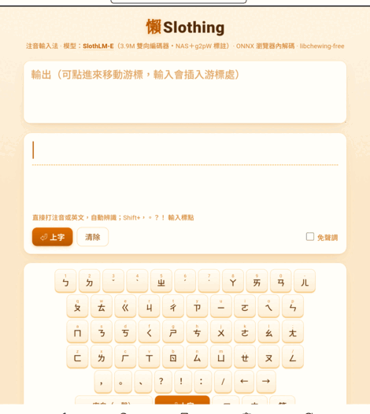
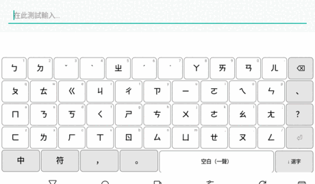

# Slothing(懶音)— an LLM-powered Zhuyin IME

**Type bopomofo; a model converts the whole sentence.** **Slothing** (Chinese
name **懶音**, from 樹懶 "sloth" + 注音 zhuyin; full zh name 樹懶注音輸入法):
a 3.8M-parameter
language model trained from scratch that decodes zhuyin to Traditional Chinese
locally — libchewing-free, with every character guaranteed to be a legal
reading of what you typed. Four frontends — desktop (fcitx5, IBus), Android,
and the browser — share one core and one model.

**中文說明(預設): [README.md](README.md)** ·
**Try it now (no install): [huggingface.co/spaces/Luigi/slothing-web](https://huggingface.co/spaces/Luigi/slothing-web)**

<p align="center"></p>
<p align="center"></p>

## Highlights

| | |
|---|---|
| **免選字 sentence conversion** | 微軟新注音-style live conversion; **74%** on the 230-case no-selection benchmark (on-device = desktop score) |
| **Auto zh/en** | No mode key: type `我用python寫程式` straight through — a DP segmenter decides |
| **Tone-optional** | Skip tone keys (~35% fewer keystrokes); context disambiguates |
| **Picks re-score the sentence** | Correct one char and the rest re-decodes around it (char-hint channel), with **persistent learning** |
| **Typo repair** | Impossible syllables fixed by the model (edit distance 1) |
| **聯想 prediction** | Next-word suggestions after commit (dictionary + personal habits): tap-to-chain on mobile, ⇧1-9 on desktop |
| **Fully offline** | 4.9 MB int8 ONNX runs locally — no cloud, no telemetry |

Sourced comparison vs Gboard 注音 and the Boox built-in IME:
**[docs/COMPARISON.md](docs/COMPARISON.md)** (zh-TW); 4-frontend UI logic matrix:
**[docs/UI-MATRIX.md](docs/UI-MATRIX.md)**.

## Install

Desktop platforms need the decode daemon (one-time setup, shared by fcitx5 + IBus):

```sh
pip install onnxruntime numpy
packaging/fetch-model.sh                  # 4.9 MB model
packaging/install-slothingd-service.sh    # auto-start at login
```

| Platform | Install |
|---|---|
| **fcitx5** (KDE, …) | `.deb` from Releases, or `cmake -B engine/fcitx5-chewing/build -S engine/fcitx5-chewing -DCMAKE_INSTALL_PREFIX=/usr && cmake --build engine/fcitx5-chewing/build -j$(nproc) && sudo make -C engine/fcitx5-chewing/build install` |
| **IBus** (GNOME, …) | `.deb` from Releases, or the one-shot `engine/ibus-slothing/install.sh`; see `engine/ibus-slothing/README.md` |
| **Android** | `.apk` from Releases (**no daemon** on the phone — decoding runs on-device), or `cd android && ./gradlew :app:assembleDebug` (needs SDK/NDK; fetch the model first) |
| **Browser** | nothing to install: [HF Space](https://huggingface.co/spaces/Luigi/slothing-web) |

## How it works

Zhuyin→Chinese is *aligned sequence labeling* (N syllables → N characters, each
constrained to its homophone set), so Slothing uses a **bidirectional encoder**
(non-autoregressive, one forward pass) instead of a causal LM: 3.8M parameters
found by Hyperband NAS over the sub-5M space, trained on g2pW context-aware
readings, with a **char-hint channel** (weight-tied to the output head, ~0
params) carrying pick feedback, document context, and typo repair. A
dependency-free DP segmenter parses the keystream (auto zh/en), and decoding is
masked per position to legal readings.

All four frontends are thin adapters over the shared core in `engine/common` —
one state machine, one segmenter, one prediction engine — held together by
offline contract tests (core_test), a headless IBus end-to-end test, and the
`eval/ui-parity` differential suite.

- Model + full reproduction pipeline (data → labels → NAS → training → ONNX):
  [Luigi/slothlm-e-4m-zhuyin](https://huggingface.co/Luigi/slothlm-e-4m-zhuyin)
- Architecture & design: `ARCHITECTURE.md`, `model/DESIGN-E.md`, `MODEL_BENCHMARKS.md`

## Numbers

| Benchmark | Score |
|---|---|
| 230-case 免選字 set (whole sentence exact) | **74%** (172/230; Android on-device matches desktop, 99% per-sentence) |
| Tonal per-char accuracy | **83%** (libchewing 71%) |
| Tone-free | 70% |

Ceiling = 微軟新注音/自然輸入法 (the test set is their no-selection answer set);
floor = libchewing. Methodology in `docs/COMPARISON.md`.

## Roadmap

- [ ] ~10M model (the 免選字 74→86 capacity gap located by the NAS capacity law)
- [ ] BIO word-boundary + model-based 聯想 head (needs a fine-tune); word-list filtering
- [ ] Android hardware-keyboard polish; regular desktop package releases
- [ ] **Senior-friendly keyboard layout** (Android): big 3×4 grouped grid + LLM disambiguation; design research in [docs/SENIOR-KEYBOARD.md](docs/SENIOR-KEYBOARD.md)

<details><summary>Done (expand)</summary>

libchewing-free engine (keyboard FSM + LLM decode) · web demo · tone-free /
auto zh/en code-switch · SlothLM-E 3.8M (NAS + g2pW) · char-hint channel
(pick re-scoring / document context / typo repair) · 新注音-style live
conversion + chewing-grade candidate window · differential UI-parity suite vs
real libchewing · full reproducibility bundle on HF · IBus engine · native
Android IME (validated on BOOX e-ink) · 聯想 on all four frontends · touch
candidate strip · learn-bonus calibration (2/3) · `.deb` / `.apk` packaging
</details>

**Non-goals:** any cloud inference or telemetry — everything runs locally.
