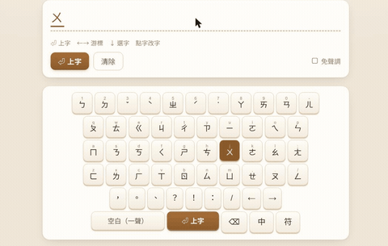
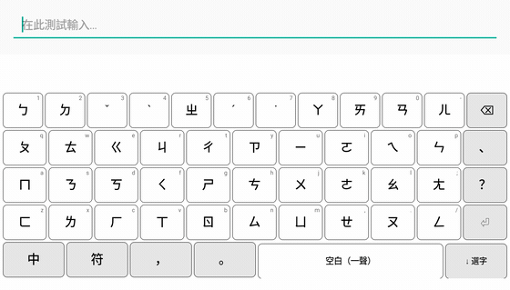

# Sloth IME (樹懶智慧輸入法)

**Type bopomofo; a small on-device model turns the whole sentence into correct
Chinese — no candidate-picking.**

Sloth IME runs **two from-scratch on-device language models**: a **12M ternary
encoder** that decodes the whole Zhuyin keystream into Traditional Chinese
(candidate-free conversion), and a **60M next-word decoder** that predicts what
you'll type next after each commit (neural 聯想). No libchewing, no cloud, and
every character guaranteed to be a legal reading of what you typed. Four
frontends — desktop (fcitx5, IBus), Android, and the browser — share the same
models.

**▶ [Try it now (no install)](https://huggingface.co/spaces/Luigi/slothing-web)** ·
[中文說明](README.md) ·
[Model](https://huggingface.co/Luigi/sloth-ime-models)

<p align="center"></p>
<p align="center"></p>

## What you get

| | |
|---|---|
| **Whole-sentence conversion** | 微軟新注音-style live conversion; no picking word-by-word |
| **Auto zh/en** | No mode key: type `我用python寫程式` straight through — a segmenter decides |
| **Typo repair** | Impossible syllables get fixed by the model |
| **Next-word suggestions** | After you commit (tap-to-chain on mobile, ⇧1-9 on desktop) |
| **Fully offline** | 9.7 MB model runs on-device — no cloud, no telemetry |

## Install

**Desktop (fcitx5 or IBus) — one command:**

```sh
git clone https://github.com/vieenrose/sloth-zhuyin-linux.git
cd sloth-zhuyin-linux
./install.sh        # auto-detects fcitx5 or IBus: builds, downloads the model, sets up autostart
```

Then add **"Sloth IME"** in your input-method settings and switch to it with
**Ctrl+Space**. (Needs `git`, `cmake`, a C++ compiler; the engine-install step
asks for `sudo`.)

| Other platforms | How |
|---|---|
| **Android** | Grab the `.apk` from Releases — offline, model built in, no daemon |
| **Browser** | Nothing to install: [live demo](https://huggingface.co/spaces/Luigi/slothing-web) |

## Accuracy

Honest held-out (500 c4-zh-TW sentences, excluded from training; 25M reference model):

| Benchmark | 25M (reference) | **12M (shipping default)** |
|---|---|---|
| Whole-sentence exact, 500-sent held-out | **76%** | — |
| Whole-sentence exact, 230-sent on-device | 85.7% | **84%** |
| Tonal per-char (homophone-hard) | **86%** (libchewing 71%) | 84% |

The 12M trades ~2 points for **half the latency and half the download**; both models
live in the [HF repo](https://huggingface.co/Luigi/sloth-ime-models) and `libslothe`
reads hyperparameters from the GGUF, so swapping the file swaps the model.

Ceiling = 微軟新注音 / 自然輸入法; floor = libchewing. Method and sourcing in
[docs/COMPARISON.md](docs/COMPARISON.md), [docs/EVAL.md](docs/EVAL.md).

## Why ternary

<p align="center"></p>

A from-scratch **SlothE-T ternary (W1.58A8) bidirectional encoder**. The shipping
**12M (dim 256 × 12 layers — dims exactly 256-aligned for TQ2_0, zero padding tax)**
measures on the BOOX (SD662): **9.3 ms @4 threads / 15.8 ms @2 threads per 6-syllable
forward**, 84% whole-sentence on the 230-sentence on-device set. The 25M reference:
85.7%, 18.5 ms @4t. The TQ2_0 kernel is ~2.3× int8 on x86 (mainline ggml), so no
bitnet.cpp is needed. (Earlier READMEs quoted "~9 ms" for the 25M — that was a
projection; the numbers above are measured.)

## How it works — one encoder + one decoder

**Encoder (conversion, 12M ternary).** Zhuyin→Chinese is *aligned sequence
labeling* (N syllables → N characters, each constrained to its homophone set), so
conversion uses a **bidirectional encoder** (non-autoregressive, one forward pass)
rather than a causal LM — the fastest possible shape on CPU: no KV cache, no
per-token loop, one forward per keystroke (measured 9.3 ms @4 threads on BOOX).
A dependency-free segmenter parses the keystream (auto zh/en) and decoding is
masked per position to legal readings.

**Decoder (prediction, 60M Q4).** After a commit, an **autoregressive decoder**
takes over: a dense-Qwen3.5 block (Gated DeltaNet linear attention + full
attention every 4th layer — recurrent O(1)/step, no KV cache) with a word-piece
vocab so *next word = one forward* (measured 8.5 ms/word on BOOX). Deploys via
the official llama.cpp qwen35 GGUF path. Currently **v2.1 (Taiwan-chat register
fine-tune: PTT/Dcard)** — chat held-out next-word 18.3 top-1 / 31.2 top-5 (v2:
10.9/21.2, +68% relative), general text 33.5/45.2 unchanged. (The original
47.3/75.8 was leak-inflated; history in docs/ARCH-REVIEW.md.) Live in the desktop daemon (`slothd -p`); frontend candidate-bar wiring
is in progress (today's 聯想 is served by the shared bigram engine).

The split mirrors the latency budget: conversion sits on the **per-keystroke**
critical path (tightest budget); prediction runs in the after-commit gap where
latency can be prefetched and hidden.

All four frontends are thin adapters over the shared core in `engine/common` and
share one **`libslothe`** ggml forward pass: a native daemon on desktop, NDK arm64
on Android, and **multi-threaded WASM** in the browser (a coi-serviceworker enables
`SharedArrayBuffer` for a **~4.7×** speedup, with automatic single-thread fallback).
All four are now fully ONNX-Runtime-free. Behavior is held together by offline
contract tests, a headless end-to-end test, and per-layer / per-character golden
checks against PyTorch.

- Model, GGUF + full reproduction pipeline: [Luigi/sloth-ime-models](https://huggingface.co/Luigi/sloth-ime-models)
- Architecture & design: [`ARCHITECTURE.md`](ARCHITECTURE.md), `model/DESIGN-E.md`
- 4-frontend UI logic matrix: [docs/UI-MATRIX.md](docs/UI-MATRIX.md)

## Reproducibility

Both models are fully reproducible from public materials; every number maps to a script:

| step | material |
|---|---|
| corpus | `model/build_corpus_big.py` (streams `erhwenkuo/c4-chinese-zhtw`, sentence-split + filter); chat register = PTT/Dcard HF datasets (see docs/ARCH-REVIEW.md) |
| encoder training | `train_slothe_ternary.py` (bundled in the HF repo) — ternary QAT + CE + label-smoothing 0.1, 32ep early-stopped; recipe history & all negative results: `docs/ARCH-REVIEW.md` |
| predictor training | `predictor_qwen35.py` (transformers Qwen3.5) + `--init-from` register fine-tune |
| evaluation | encoder: `gate_slothe_ternary.py` (免選字/homophone/toneless); predictor: **always fresh-corpus** (the lesson of two benchmark leaks, `docs/ARCH-REVIEW.md`) |
| packaging | encoder: `extract_slothe.py` + `pack_gguf.py` → TQ2_0 GGUF; predictor: official `convert_hf_to_gguf.py` (pre-tokenizer `default`) + `llama-quantize Q4_K_M` |
| weights | everything (GGUF + fp32 masters) at [Luigi/sloth-ime-models](https://huggingface.co/Luigi/sloth-ime-models), incl. `REPRODUCE.md` |

## Roadmap

- [x] **25M ternary shipped to all four frontends**: 76 / 86, all sharing `libslothe` (ggml/TQ2_0), replacing ONNX Runtime
- [x] **12M ternary (256×12) is the new default**: same accuracy class, half the latency and download; `libslothe` now reads hparams from the GGUF; meets the ≤20 ms budget at 2 threads on BOOX (15.8 ms)
- [x] **Neural next-word (desktop daemon)**: 60M Q4 predictor serves `slothd`'s `{"predict": …}` op; frontend UI wiring pending
- [x] **Predictor v2.1**: 6.1M-line retrain (exposed a second benchmark leak — the old 47.3 was memorization; honest new model is 7× better) + PTT/Dcard register fine-tune (+68% relative chat top-1); shipped drop-in
- [x] **v0.2.0 released**: `.apk` (12M bundled) + `.deb`; full two-model weights (enc 12M/25M + dec 60M, GGUF+fp32) on [HF](https://huggingface.co/Luigi/sloth-ime-models); README/model card now measured-numbers-only
- [x] ~~KD-on-ternary~~: tested, **not shipped** — homophone +5 (89%, best recorded) but 免選字 −6 (78%, a stable ceiling even +12ep); KD overlaps label smoothing as a regularizer. See docs/ARCH-REVIEW.md
- [ ] **Char-hints v2 (document context)**: the hinted model is trained and validated on clean held-out — document context *does* help (**+2.4%** whole-sentence), but the win is small and only for long-form, so it's deferred (not worth plumbing through all 4 frontends yet)
- [ ] Wire neural next-word into the frontend candidate bars (fcitx5/IBus/Android; Android needs llama.cpp JNI + the 60M Q4 bundled)
- [ ] Android hardware-keyboard polish; regular desktop packages
- [ ] [Senior-friendly keyboard layout](docs/SENIOR-KEYBOARD.md): standard layout + key-error-tolerant decoding

**Non-goals:** any cloud inference or telemetry — everything runs locally.

<details><summary>Milestones done</summary>

libchewing-free engine · web demo · auto zh/en · SlothLM-E 11.6M ·
char-hint channel · 新注音-style live conversion + candidate window · libchewing
UI-parity suite · full reproducibility bundle on HF · IBus engine · native Android
IME (BOOX e-ink) · 4-frontend next-word · `.deb` / `.apk` packaging ·
**25M ternary model + libslothe deployed to all four frontends**
</details>
