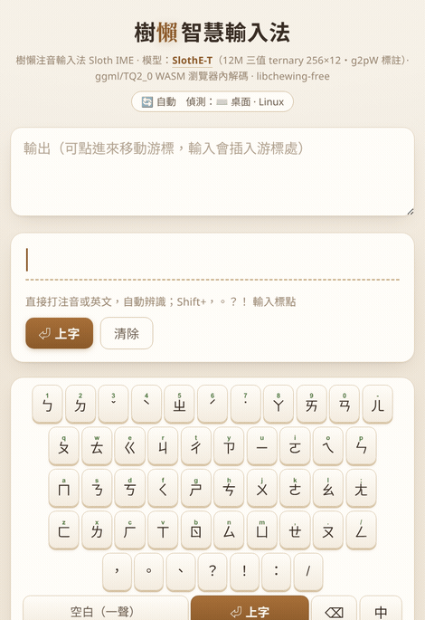
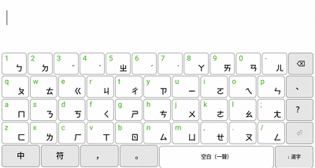
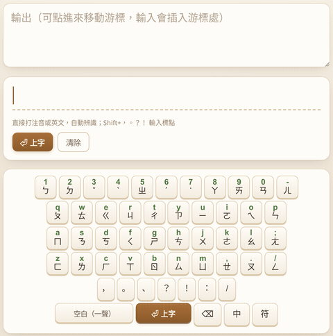

# 樹懶智慧輸入法（Sloth IME）

**打注音，一顆本機小模型幫你整句轉成正確的中文——免選字。**

樹懶注音輸入法（Sloth IME）用**兩顆從零訓練的本機語言模型**：一顆 **12M 三值
（ternary）編碼器**把注音整句解碼成繁體中文（免選字），一顆 **60M 次詞預測解碼器**
在上字後預測你接下來要打的詞（神經聯想）。不靠 libchewing、不連雲端，每個字都保證
「音對得上」。桌面（fcitx5、IBus）、Android、瀏覽器四種前端共用同一套模型。

**▶ [線上試用（免安裝）](https://huggingface.co/spaces/Luigi/slothing-web)** ·
[English](README.en.md) ·
[模型下載](https://huggingface.co/Luigi/sloth-ime-models)

<p align="center"></p>
<p align="center"></p>
<p align="center"><br><sub>聯想接詞:上字後預測下一個詞,⇧1-9 或點選接龍</sub></p>

## 特色

| | |
|---|---|
| **整句免選字** | 微軟新注音式即打即轉,不用逐字挑 |
| **中英自動切換** | 不用切模式:`我用python寫程式` 直接打,切分器自動判斷 |
| **打錯也救得回** | 不合法的音節由模型自動修正 |
| **聯想接詞** | 上字後預測下一個詞(行動點選、桌面 ⇧1-9) |
| **完全離線** | 9.7 MB 模型本機執行,零雲端、零遙測 |

## 安裝

**桌面（fcitx5 或 IBus）——一行指令：**

```sh
git clone https://github.com/vieenrose/sloth-zhuyin-linux.git
cd sloth-zhuyin-linux
./install.sh          # 自動偵測 fcitx5 或 IBus,建置、下載模型、設定登入自啟
```

裝好後,在你的輸入法設定裡加入「Sloth IME」,用 **Ctrl+Space** 切換就能用。
（需要 `git`、`cmake`、C++ 編譯器;安裝引擎那一步會要 `sudo`。）

| 其他平台 | 怎麼用 |
|---|---|
| **Android** | 下載 Releases 的 `.apk`——離線、模型內建、免 daemon |
| **瀏覽器** | 免安裝,直接開 [線上 Demo](https://huggingface.co/spaces/Luigi/slothing-web) |

## 準確度

500 句 held-out 誠實值(c4-zh-TW,排除訓練語料,25M 參考模型):

| 基準 | 25M(參考) | **12M(預設出貨)** |
|---|---|---|
| 免選字（整句全對,500 句） | **76%** | — |
| 免選字（230 句裝置實測） | 85.7% | **84%** |
| 有聲調逐字（同音難句） | **86%**（libchewing 71%） | 84% |

12M 用約 -2 分換 **一半延遲與一半下載**;兩顆模型都在
[HF repo](https://huggingface.co/Luigi/sloth-ime-models),`libslothe`
從 GGUF 讀超參數,換檔即換模型。

天花板是微軟新注音／自然輸入法,樓板是 libchewing。量法與對照見
[docs/COMPARISON.md](docs/COMPARISON.md)、[docs/EVAL.md](docs/EVAL.md)。

## 為什麼是「三值」模型

<p align="center"></p>

從零訓練的 **SlothE-T 三值（W1.58A8）雙向編碼器**。出貨版 **12M（dim256×12 層,
維度恰為 TQ2_0 的 256 對齊,零填充稅）在 BOOX(SD662)實測:單次 6 音節前向
9.3ms(4 執行緒)／15.8ms(2 執行緒)**,免選字 84(230 句裝置實測)。25M 版
85.7%、18.5ms(4 執行緒)。速度上 TQ2_0 三值核心約是 int8 的 2.3×(主線 ggml
kernel),不需要 bitnet.cpp。(舊版 README 的「約 9ms」是投影值;上面是實測。)

## 它怎麼運作 — 一顆編碼器 + 一顆解碼器

**編碼器(轉換,12M 三值)**:注音→中文是「對齊的序列標註」(N 音節 → N 字,
各自限於同音字集),所以用**雙向編碼器**(非自回歸、一次前向)而非因果 LM——
這是 CPU 上最快的形狀:無 KV cache、無逐字迴圈,每鍵一次前向(BOOX 實測
9.3ms/4 執行緒)。鍵流由零相依的切分器解析(中英自動判斷),解碼時每個位置
只在合法讀音裡選字。

**解碼器(預測,60M Q4)**:上字之後換**自回歸解碼器**接手——dense-Qwen3.5
架構(Gated DeltaNet 線性注意力 + 每 4 層一層全注意力,遞迴 O(1)/步、免
KV cache),詞片詞表讓「下一個詞 = 一次前向」(BOOX 實測 8.5ms/詞)。經
llama.cpp 官方 qwen35 GGUF 路徑部署。目前為 **v2.1(台灣聊天語域微調:PTT/Dcard)**——聊天 held-out 次詞 top-1 18.3 / top-5 31.2(v2 為 10.9/21.2,相對 +68%),一般語料 33.5/45.2 持平。(最初的 47.3/75.8 為沾染值;沿革見 docs/ARCH-REVIEW.md。)
桌面 daemon 已上線(`slothd -p`);前端候選列接線中,現行聯想由共用 bigram
引擎供應。

兩顆模型分工正好對應延遲預算:轉換在**每個按鍵**的關鍵路徑上(預算最緊),
預測在上字後的空檔執行(可預取、可隱藏)。

四個前端都是 `engine/common` 共用核心的薄介接層,共用同一份 **`libslothe`**
ggml 前向:桌面走 native daemon、Android 走 NDK arm64、瀏覽器走多執行緒 WASM
(coi-serviceworker 開啟 SharedArrayBuffer,較單執行緒約快 **4.7×**;無 SharedArrayBuffer
時自動退回單執行緒)。四前端皆已完全移除 ONNX Runtime。行為由離線契約測試、
無頭端對端測試,與對 PyTorch 逐層／逐字的 golden 驗證把關。

- 模型、GGUF 與完整重現流程:[Luigi/sloth-ime-models](https://huggingface.co/Luigi/sloth-ime-models)
- 架構與設計:[`ARCHITECTURE.md`](ARCHITECTURE.md)、`model/DESIGN-E.md`
- 四前端 UI 邏輯對照:[docs/UI-MATRIX.md](docs/UI-MATRIX.md)

## 重現（Reproducibility）

兩顆模型都可從公開材料完整重現;所有數字都有腳本可對應:

| 步驟 | 材料 |
|---|---|
| 語料 | `model/build_corpus_big.py`(串流 `erhwenkuo/c4-chinese-zhtw`,句切+過濾);聊天語域 = PTT/Dcard HF 資料集(見 docs/ARCH-REVIEW.md) |
| 編碼器訓練 | `train_slothe_ternary.py`(HF repo 內附)——ternary QAT + CE + label-smoothing 0.1、32ep 早停;配方沿革與所有負結果:`docs/ARCH-REVIEW.md` |
| 預測器訓練 | `predictor_qwen35.py`(transformers Qwen3.5)+ `--init-from` 語域微調 |
| 評測 | 編碼器:`gate_slothe_ternary.py`(免選字/同音/無聲調);預測器:**務必用新鮮語料**(兩次基準沾染的教訓,`docs/ARCH-REVIEW.md`) |
| 打包部署 | 編碼器:`extract_slothe.py` + `pack_gguf.py` → TQ2_0 GGUF;預測器:官方 `convert_hf_to_gguf.py`(pre-tokenizer 用 `default`)+ `llama-quantize Q4_K_M` |
| 權重 | 全部(GGUF + fp32 master)在 [Luigi/sloth-ime-models](https://huggingface.co/Luigi/sloth-ime-models),含 `REPRODUCE.md` |

## 藍圖

- [x] **25M 三值上線四前端**:免選字 76 / 同音 86,共用 `libslothe`(ggml/TQ2_0)取代 ONNX Runtime
- [x] **12M 三值(256×12)成為預設**:同準確度級距、延遲與下載减半;`libslothe` 改讀 GGUF 超參數,BOOX 2 執行緒 15.8ms 達標 ≤20ms
- [x] **神經聯想(桌面 daemon)**:60M Q4 次詞預測模型上線 `slothd` `{"predict":…}` 口;前端 UI 接線進行中
- [x] **預測模型 v2.1**:6.1M 句重訓(揭露第二次基準沾染:舊 47.3 實為記憶,新模型誠實 7×)+ PTT/Dcard 語域微調(聊天 +68% 相對 top-1);drop-in 出貨
- [x] **v0.2.0 發佈**:`.apk`(12M 內建)+ `.deb`;雙模型權重(enc 12M/25M + dec 60M,GGUF+fp32)齊上 [HF](https://huggingface.co/Luigi/sloth-ime-models);README/模型卡全面改為實測數據
- [x] ~~KD-on-ternary~~:已測,**不出貨**——同音 +5(89%,歷來最佳)但免選字 -6(78%,+12ep 加訓仍為天花板);蒸餾與 label smoothing 正則重疊,詳見 docs/ARCH-REVIEW.md
- [ ] **字提示 v2(文件語境)**:帶字提示模型已訓練並在乾淨 held-out 驗證——文件語境確實有用(整句 **+2.4%**),但幅度小、僅長文受益,暫緩接線至四前端
- [ ] 前端 UI 接上神經聯想(fcitx5/IBus/Android 候選列;Android 需捆 llama.cpp JNI + 60M Q4)
- [ ] Android 實體鍵盤完善;桌面套件常態發佈
- [ ] [銀髮族鍵盤佈局](docs/SENIOR-KEYBOARD.md):標準佈局＋按鍵容錯解碼

**非目標:** 任何雲端推論或遙測——一切都在本機執行。

<details><summary>已完成里程碑</summary>

libchewing-free 引擎 · 網頁 demo · 中英混打 · SlothLM-E 11.6M · 字提示通道 ·
新注音式即打即轉＋候選窗 · libchewing 差分 UI-parity 套件 · HF 完整重現流程 ·
IBus 引擎 · Android 原生 IME(BOOX 實測)· 四前端聯想 · `.deb`／`.apk` 打包 ·
**25M 三值模型 + libslothe 四前端部署**
</details>
