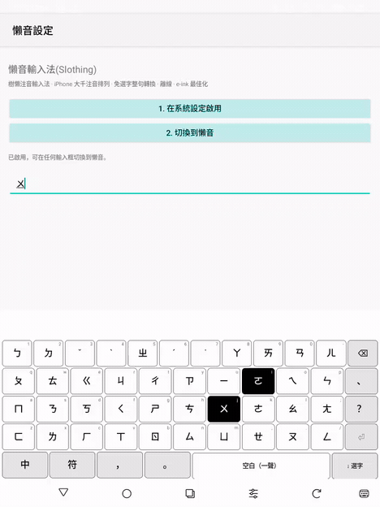

# 懶音輸入法(Slothing)— LLM 注音輸入法

**打注音,模型整句轉換。** 懶音輸入法(全名「樹懶注音輸入法」,英文名 Slothing)
用一顆從零訓練的 **25M 三值(ternary, W1.58A8)** 語言模型在本機把注音解碼成
繁體中文——不依賴 libchewing,每個字保證「音對得上」,絕不亂猜。桌面
(fcitx5、IBus)、Android、瀏覽器四個前端,共用同一個核心、同一顆模型,以及同一個
**ggml 推論核心(libslothe / TQ2_0),取代 ONNX Runtime**。

**English: [README.en.md](README.en.md)** ·
**線上試用(免安裝):[huggingface.co/spaces/Luigi/slothing-web](https://huggingface.co/spaces/Luigi/slothing-web)** ·
**模型:[Luigi/slothe-t-25m-zhuyin](https://huggingface.co/Luigi/slothe-t-25m-zhuyin)**

<p align="center"></p>
<p align="center"></p>

## 特色

| | |
|---|---|
| **免選字整句轉換** | 微軟新注音式即打即轉;免選字基準 **76%**(held-out 誠實整句值,見 [docs/EVAL.md](docs/EVAL.md)) |
| **中英自動切換** | 不用切模式:`我用python寫程式` 直接打,DP 切分器自動判斷 |
| **免聲調** | 省掉聲調鍵(少打約 35%),模型靠語境消歧 |
| **打錯也能解** | 不合法音節由模型自動修正(編輯距離 1) |
| **聯想** | 上字後預測下一個詞(詞典＋個人習慣):行動點選接龍、桌面 ⇧1-9 |
| **完全離線** | **18 MB 三值 GGUF**,以 ggml / libslothe(TQ2_0 核心)本機執行——ARM/x86/WASM,較 int8 快約 2×,零雲端、零遙測 |

> **選字重評分／文件語境**(字提示通道)為 **v2**:v1 先上準確度最佳的無提示
> 模型,帶字提示的三值模型正在重訓,通過驗證後復原此功能。

與 Gboard 注音、Boox 內建輸入法的誠實對照(附來源):**[docs/COMPARISON.md](docs/COMPARISON.md)**;
四前端 UI 邏輯對照:**[docs/UI-MATRIX.md](docs/UI-MATRIX.md)**。

## 安裝

桌面平台需要解碼 daemon(一次設定,fcitx5 與 IBus 共用),以 ggml 執行三值模型:

```sh
# 先建置本機 ggml 執行環境(llm/llama.cpp,見 README「本機 LLM 執行環境」),再:
cmake -S engine/slothingd -B engine/slothingd/build_slothe -DCMAKE_BUILD_TYPE=Release
cmake --build engine/slothingd/build_slothe --target slothingd_slothe
packaging/fetch-model.sh                   # 下載 18 MB 三值 GGUF
packaging/install-slothingd-service.sh     # 登入自動啟動
```

| 平台 | 安裝 |
|---|---|
| **fcitx5**(KDE 等) | Releases 的 `.deb`,或 `cmake -B engine/fcitx5-chewing/build -S engine/fcitx5-chewing -DCMAKE_INSTALL_PREFIX=/usr && cmake --build engine/fcitx5-chewing/build -j$(nproc) && sudo make -C engine/fcitx5-chewing/build install` |
| **IBus**(GNOME 等) | Releases 的 `.deb`,或一鍵腳本 `engine/ibus-slothing/install.sh`;詳見 `engine/ibus-slothing/README.md` |
| **Android** | Releases 的 `.apk`(手機上**免 daemon**,解碼在裝置端;模型隨 APK 打包,無 ONNX 執行期,APK 較舊版小約 20 MB),或 `cd android && ./gradlew :app:assembleDebug`(需 SDK/NDK) |
| **瀏覽器** | 免安裝:[HF Space](https://huggingface.co/spaces/Luigi/slothing-web) |

## 它怎麼運作

注音→中文是「對齊的序列標註」(N 音節 → N 字,各自受限於同音字集),所以用
**雙向編碼器**(非自回歸,一次前向)而非因果 LM:**25M 三值參數**(每權重
{−1,0,+1}×絕對中位數尺度,int8 激活,QAT/STE;邊界層保留 fp)、g2pW 語境讀音
標註訓練。鍵流由零相依的 DP 切分器解析(中英自動判斷),解碼輸出逐字限制在合法
讀音內。

四個前端(fcitx5 / IBus / Android / 網頁)都是 `engine/common` 共用核心的薄
介接層,並共用同一個 **`libslothe`** 推論實作——一份 ggml 前向(重用主線
ggml 的 TQ2_0 三值核心),桌面走 native daemon、Android 走 NDK arm64、網頁走
Emscripten WASM。行為以離線契約測試(core_test)、IBus 無頭端對端測試、
`eval/ui-parity` 差分套件,以及對 PyTorch 逐層/逐字 golden 驗證把關。

- 模型、GGUF 與完整重現流程(資料→標註→訓練→轉檔):[Luigi/slothe-t-25m-zhuyin](https://huggingface.co/Luigi/slothe-t-25m-zhuyin)
- 架構與設計:`ARCHITECTURE.md`、`model/DESIGN-E.md`、`MODEL_BENCHMARKS.md`

## 數字

held-out 誠實值(500 句 c4-zh-TW,排除訓練語料):

| 基準 | 分數 |
|---|---|
| 免選字(整句全對) | **76%**(380/500)|
| 有聲調逐字準確率(同音難句)| **86%**(libchewing 71%)|
| 免聲調 | **77%** |

天花板 = 微軟新注音/自然輸入法;樓板 = libchewing。量法與對照見
`docs/COMPARISON.md`。速度:TQ2_0 三值核心在 x86 約 int8 的 2.3×(主線 ggml
kernel benchmark);無需 bitnet.cpp。

## 藍圖

- [x] ~10M 模型:免選字 74→**84**(11.6M int8,舊基準)
- [x] **25M 三值上線四前端**:免選字 **76** / 同音 **86** / 免聲調 **77**(held-out
  誠實值),四前端共用 `libslothe`(ggml / TQ2_0)取代 ONNX Runtime;桌面 daemon、
  Android APK(−20 MB)、網頁 WASM 全數通過 golden 驗證。**在此規模三值勝 int8**
  (與 11.6M 相反)
- [ ] **字提示 v2**:重訓帶字提示的三值模型,復原選字/文件語境重評分
- [ ] BIO 詞界＋模型式聯想頭(需微調);詞表交集過濾非詞
- [ ] Android 實體鍵盤完善;桌面套件常態發佈
- [ ] **銀髮族鍵盤佈局**:標準佈局＋按鍵容錯解碼;設計研究見 [docs/SENIOR-KEYBOARD.md](docs/SENIOR-KEYBOARD.md)

<details><summary>已完成(展開)</summary>

libchewing-free 引擎(鍵盤 FSM＋LLM 解碼)· 網頁 demo · 免聲調/中英混打 ·
SlothLM-E 11.6M(NAS 衍生＋g2pW)· 字提示通道(選字重評分/文件語境/錯字修復)·
新注音式即打即轉＋酷音級候選窗 · libchewing 差分 UI-parity 套件 · HF 完整
重現流程 · IBus 引擎 · Android 原生 IME(BOOX e-ink 實測)· 四前端聯想 ·
觸控候選列 · 學習加分校準(2/3)· `.deb` / `.apk` 打包框架 ·
**25M 三值模型 + libslothe(ggml/TQ2_0)四前端部署**
</details>

**非目標:** 任何雲端推論、遙測——一切都在本機執行。
