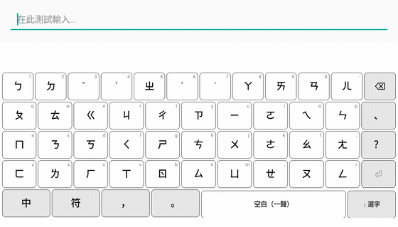
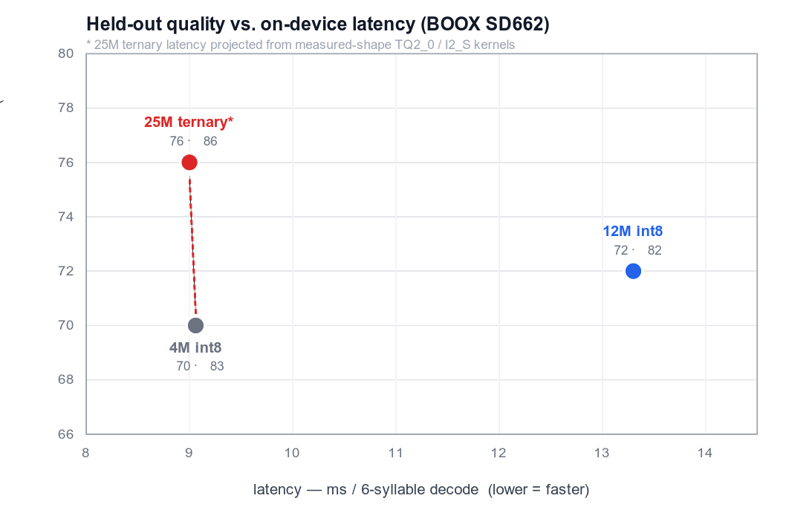

# 懶音輸入法（Slothing）

**打注音，一顆本機小模型幫你整句轉成正確的中文——免選字。**

樹懶注音輸入法（Slothing）用一顆從零訓練的 **25M 三值（ternary）語言模型**，
在你的裝置上把注音解碼成繁體中文。不靠 libchewing、不連雲端，每個字都保證
「音對得上」。桌面（fcitx5、IBus）、Android、瀏覽器四種前端共用同一顆模型。

**▶ [線上試用（免安裝）](https://huggingface.co/spaces/Luigi/slothing-web)** ·
[English](README.en.md) ·
[模型下載](https://huggingface.co/Luigi/slothe-t-25m-zhuyin)

<p align="center"></p>
<p align="center"></p>

## 特色

| | |
|---|---|
| **整句免選字** | 微軟新注音式即打即轉,不用逐字挑 |
| **中英自動切換** | 不用切模式:`我用python寫程式` 直接打,切分器自動判斷 |
| **免聲調也能打** | 省掉聲調鍵(少打約 35%),模型靠語境消歧 |
| **打錯也救得回** | 不合法的音節由模型自動修正 |
| **聯想接詞** | 上字後預測下一個詞(行動點選、桌面 ⇧1-9) |
| **完全離線** | 18 MB 模型本機執行,零雲端、零遙測 |

## 安裝

**桌面（fcitx5 或 IBus）——一行指令：**

```sh
git clone https://github.com/vieenrose/sloth-zhuyin-linux.git
cd sloth-zhuyin-linux
./install.sh          # 自動偵測 fcitx5 或 IBus,建置、下載模型、設定登入自啟
```

裝好後,在你的輸入法設定裡加入「Slothing」,用 **Ctrl+Space** 切換就能用。
（需要 `git`、`cmake`、C++ 編譯器;安裝引擎那一步會要 `sudo`。）

| 其他平台 | 怎麼用 |
|---|---|
| **Android** | 下載 Releases 的 `.apk`——離線、模型內建、免 daemon |
| **瀏覽器** | 免安裝,直接開 [線上 Demo](https://huggingface.co/spaces/Luigi/slothing-web) |

## 準確度

500 句 held-out 誠實值(c4-zh-TW,排除訓練語料):

| 基準 | 分數 |
|---|---|
| 免選字（整句全對） | **76%** |
| 有聲調逐字（同音難句） | **86%**（libchewing 71%） |
| 免聲調 | **77%** |

天花板是微軟新注音／自然輸入法,樓板是 libchewing。量法與對照見
[docs/COMPARISON.md](docs/COMPARISON.md)、[docs/EVAL.md](docs/EVAL.md)。

## 為什麼是「三值」模型

<p align="center"></p>

從零訓練的 **SlothE-T 25M 三值（W1.58A8）雙向編碼器**。在 BOOX（SD662）實測延遲
下它是 **Pareto 最佳**:約 **9ms／6 音節**就有 **免選字 76%**,和只有 4M 的 int8
同速卻準得多,而且比 12M int8 又快又準(13ms、免選字 72)。**在這個規模,三值勝
int8**。速度上 TQ2_0 三值核心約是 int8 的 2.3×(主線 ggml kernel),不需要 bitnet.cpp。

## 它怎麼運作

注音→中文是「對齊的序列標註」(N 音節 → N 字,各自限於同音字集),所以用
**雙向編碼器**(非自回歸、一次前向)而非因果 LM。鍵流由零相依的切分器解析
(中英自動判斷),解碼時每個位置只在合法讀音裡選字。

四個前端都是 `engine/common` 共用核心的薄介接層,共用同一份 **`libslothe`**
ggml 前向:桌面走 native daemon、Android 走 NDK arm64、瀏覽器走 WASM。行為由
離線契約測試、無頭端對端測試,與對 PyTorch 逐層／逐字的 golden 驗證把關。

- 模型、GGUF 與完整重現流程:[Luigi/slothe-t-25m-zhuyin](https://huggingface.co/Luigi/slothe-t-25m-zhuyin)
- 架構與設計:[`ARCHITECTURE.md`](ARCHITECTURE.md)、`model/DESIGN-E.md`
- 四前端 UI 邏輯對照:[docs/UI-MATRIX.md](docs/UI-MATRIX.md)

## 藍圖

- [x] **25M 三值上線四前端**:免選字 76 / 同音 86 / 免聲調 77,共用 `libslothe`(ggml/TQ2_0)取代 ONNX Runtime
- [ ] **字提示 v2**:重訓帶字提示的三值模型,復原選字重評分／文件語境(目前正在調配方,尚未勝過無提示版)
- [ ] 模型式聯想頭;詞表過濾非詞
- [ ] Android 實體鍵盤完善;桌面套件常態發佈
- [ ] [銀髮族鍵盤佈局](docs/SENIOR-KEYBOARD.md):標準佈局＋按鍵容錯解碼

**非目標:** 任何雲端推論或遙測——一切都在本機執行。

<details><summary>已完成里程碑</summary>

libchewing-free 引擎 · 網頁 demo · 免聲調／中英混打 · SlothLM-E 11.6M · 字提示通道 ·
新注音式即打即轉＋候選窗 · libchewing 差分 UI-parity 套件 · HF 完整重現流程 ·
IBus 引擎 · Android 原生 IME(BOOX 實測)· 四前端聯想 · `.deb`／`.apk` 打包 ·
**25M 三值模型 + libslothe 四前端部署**
</details>
