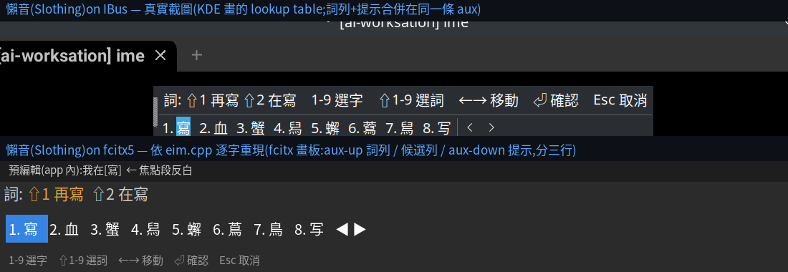

# 四前端 UI 對照:改字、改詞、聯想(2026-07-11)

逐檔案抽取(file:line 依據見 session 記錄),對照 fcitx5 / IBus / 網頁 / Android
在**改字、改詞、預測**三件事上的版面與邏輯。共用核心(`engine/common/core.h`)
保證 Choosing 狀態機語意一致;差異在各前端的「表面」— 有些是平台合理差異,
有些是真缺口。

## 對照表

| 面向 | fcitx5 | IBus | 網頁 | Android |
|---|---|---|---|---|
| **打字時常駐列** | 無(僅預編輯) | 無 | 無 | **字**(句尾字候選)+**句**(整句 n-best),自動 |
| **改字入口** | ↓ / Ctrl+⏎ | ↓ | ↓ 或**點預編輯的字** | ↓選字鍵 / 長按空白;**句尾字直接點條上的字** |
| **改字介面** | 系統候選窗(1-9、翻頁) | lookup table(同) | 面板內 #cands(1-9、‹›翻頁) | 同一條 bar(1-9 標號、捲動) |
| **段落移焦** | ←→(關窗時) | ←→ | j / k | ‹ › 晶片 |
| **選後語意** | 選字關窗+重評分 | 同 | 同 | 同 |
| **改詞(詞)** | aux 列 ⇧1-9(**不可點**,純文字) | aux 文字(同) | #phrases 晶片:⇧1-9/點/←→⏎ | 詞晶片:點(⇧N 僅為標示) |
| **聯想(上字後)** | **無** | **無** | **無** | 聯:詞典 5178 字頭+個人 bigram,點選接龍(上限 5) |
| **學習觸發** | Choosing 上字 diff | 同 | 每次選字/詞(localStorage) | Choosing 上字 + 句中即點改字 + **每次上字記 bigram** |
| **學習儲存** | daemon learn.tsv | 同 | `sloth-learn`(音節→字) | learn.tsv + assoc_user.tsv |

## 分類:平台合理 vs 真缺口

**平台合理(保留差異):**
- 桌面打字時不顯示常駐候選列 — 新注音/酷音的桌面慣例就是「即打即轉+↓」;
  行動慣例才是自動候選列。不移植。
- Android 無 ←→ 預編輯游標(軟鍵盤無方向鍵)— 與 Gboard 相同的已知限制
  (Gboard 亦不能移游標進 reading,見 UX 研究)。
- 網頁「點字改字」(滑鼠直接點預編輯字)是網頁專屬優勢;fcitx/IBus 的預編輯
  在應用程式內,無法攔截點擊。天生差異。
- Android 詞晶片僅可點(軟鍵盤無 ⇧ 數字)— 合理。

**真缺口(應修):**

| # | 缺口 | 建議 |
|---|---|---|
| G1 | ~~桌面無聯想~~ **已修**(assoc.h 共用;fcitx/IBus 上字後 aux `聯:⇧1…`,⇧1-9 選;fcitx 有 Association 設定;IBus 冒煙測試 7/7 驗證) | — |
| G2 | ~~網頁無聯想~~ **已修**(assoc.js 鎖步雙生;#phrases 列顯示 聯 晶片,點選/⇧1-9 接龍;已部署 Space) | — |
| G3 | ~~網頁觸控模式無字/句常駐列~~ **已修**(decodeZh 回傳 margins;觸控模式 #cands 常駐列:字=句尾字候選、句=最小差距翻字替代句;BOOX 瀏覽器實測含點選改字) | — |
| G4 | ~~Android 句晶片點選不學習~~ **已修**(commitSentence 學 alt vs best 的差異字) | — |
| G5 | fcitx 詞 chips 不可點(aux 純文字) | 低優先;鍵選已足,litmus:酷音也不可點 |
| G6 | Android 無實體鍵盤路徑(onKeyDown)——Boox 常接藍牙鍵盤 | 中期:physical-key → 同核心按鍵路由 |

## 架構建議

1. **聯想引擎上移共用層**:`assoc_tc.tsv` 載入、個人 bigram、tail 追蹤從
   `android/app/cpp/session.h` 抽到 `engine/common/assoc.h`(前端無關、可離線
   測試),桌面經 packaging 安裝 assoc_tc.tsv;網頁做 JS 鎖步雙生(如
   segment.js ↔ segment.h 前例)。
2. **學習語意統一**:「使用者明確選擇」= 學。句晶片選擇亦然(G4)。
3. **桌面聯想遵微軟**:上字後 aux 顯示、⇧1-9 選(數字鍵保持可打字);
   任意其他鍵立即消失,故預設**開**(fcitx 有 Association 設定可關)。

## fcitx5 vs IBus:同一狀態的實際版面(2026-07-11)

按鍵與語意**逐項相同**(同一個 ChoosingCore):↓ 開窗、1-9 選字、⇧1-9 選詞、
←→ 移動、⏎ 確認、Esc 兩段取消、PgUp/PgDn 翻頁。版面差異只有兩點,皆為
框架所致:

1. **行數**:fcitx 給三個面(aux-up 詞列/候選列/aux-down 提示);IBus 只有
   lookup table + **單一條** aux,詞列與提示擠同一行。
2. **誰畫**:fcitx 自繪(可主題化);IBus 由桌面(KDE/GNOME)代畫,字型
   配色隨桌面。

> **「感覺差很多」的真正原因(2026-07-11 診斷)**:筆電上的 fcitx addon 是
> 7/10 16:56 的舊建置(早於共用核心抽出與其後所有修正),且 fcitx5 本體已被
> `apt autoremove` 移除。重新安裝 fcitx5 + 重建 addon 後,兩者行為即一致。

## 對照 chewing 官方前端(同框架的基準)

依 upstream 原始碼逐一查證(ibus-chewing v2.1.7、fcitx5-chewing v5.1.12、
libchewing master)。重點:**chewing 自家的兩個前端之間本來就有差異**
(預設每頁 5 vs 10、space-as-selection 預設關 vs 開、easy-symbol 預設開 vs
關、簡/糊拼引擎選項只在 ibus 版)——同框架不同文化是常態。

| 面向 | chewing(ibus/fcitx5) | 樹懶(ibus/fcitx5) |
|---|---|---|
| 開窗 | ↓ 於游標字(同) | ↓ 於游標字 ✓ 對齊 |
| 詞/字呈現 | **長度循環**:同一窗先最長詞,Down 翻過末頁→縮短詞距(台北市→北市→市→回捲) | **同時呈現**:詞列(aux)+字列(表)並列——刻意改良(使用者決策,見 waiver) |
| aux 內容 | 僅 libchewing 通知(加入:/已有:/加詞失敗)與模式通知;**不放注音、不放提示** | 詞列 + 按鍵提示(較滿) |
| 預編輯 | 注音符號**行內**插在游標處,游標字塊狀著色 | 即打即轉中文(免選字),焦點段反白——範式差異 |
| 聯想 | **無**(兩前端、核心皆無) | 桌面目前無(G1);Android 已有 |
| 學習 | Shift+←→ 圈詞+⏎ 加詞;Ctrl+2-9 加詞 | 選字/詞自動 learn-diff——不同範式 |
| 失焦 | ibus 版上字(PREEDIT_COMMIT);fcitx 版可設 | 兩前端皆上字 ✓ 對齊 |
| 窗內 j/k | 有(libchewing Rust 版:移動改字點) | 網頁版有 j/k;fcitx/ibus 用關窗←→移焦——小差異 |

**結論**:樹懶兩前端的差異(單/多 aux 行、桌面代畫)與 chewing 兩前端
的差異同源同級,屬框架常態;真正需要動手的仍是 UI-MATRIX 上表的 G1–G4
(桌面/網頁聯想、網頁觸控條、句晶片學習)與筆電 fcitx 重建。
